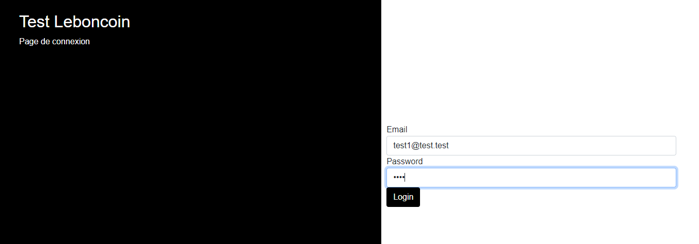

## Documentation

### Installer les dépendances
```shell
git clone git@github.com:ohugonnot/leboncoin.git
composer install
yarn install
encore dev --watch
```

#### Connecter a une base de donnée en modifiant le .env
```dotenv
DATABASE_URL="mysql://root:@127.0.0.1:3306/leboncoin?serverVersion=5.7"
```
Dans le repertoire du projet
```shell
php bin/console doctrine:database:create
php bin/console doctrine:migrations:migrate
// Charger les fixtures (fake data)
php bin/console doctrine:fixtures:load
```

### Monter le serveur
```shell
// avec le symfony executeur
symfony server:start
// sinon
composer require symfony/web-server-bundle --dev
php bin/console server:start
```

#Docker
```shell
docker-compose run php-fpm composer install
docker-compose run php-fpm  bin/console doctrine:database:create
docker-compose run php-fpm  bin/console doctrine:database:create --env=test
docker-compose run php-fpm  bin/console doctrine:migrations:migrate
// Charger les fixtures (fake data)
docker-compose run php-fpm  bin/console doctrine:migration:sync-metadata-storage
docker-compose run php-fpm  bin/console doctrine:fixtures:load
```

### Pour se connecter
http://localhost:8000/      
login : test1@test.test      
mdp : test


### Pour les tests
```shell
php bin/console doctrine:database:create --env=test
php ./vendor/bin/phpunit
```

## Todo
- Nouvelle refacto de Doctrine Inheritence Mapping, créer un FormType par entité est spécifié les asserts dans la classe
- Ajouter un système de création de Token crypté (JWT) avec un délais de validité et ne plus utiliser uniquement l'adresse mail comme token
- Ajouter un event listener sur les erreurs pour les transformer en JSON et améliorer les infos de retour et bloquer les retours sensibles pour la sécurité
- Optimiser le moteur de recherche avec le % de match pour faire la requête directement en DQL plutôt que Full PHP
- Ajouter des variables get (limit,sort,order,offset) pour créer les pagers et améliorer l'utilisation de l'api
- Ajouter un système de cache pour l'API avec Doctrine Cache pour améliorer les perfs
- Ajouter les tests unitaires et fonctionnels sur les parties sensibles (route POST, PUT, DELETE, GET et la recherche)
- Monter le projet avec docker


### Problèmes, questionnements et stratégies rencontrés lors de la conception
- Architecture de la BDD, une classe annonce globale avec des champs dynamiques VS plusieurs tables avec les types d'annonce (AnnonceAutomobile, AnnonceEmploi, AnnonceImmobilier) à débattre
  - Je suis parti sur une seul table Annonce en BDD avec un formulaire et des assertions dynamique dans le formType pour vérifier la cohérence de l'annonce mais je ne suis pas forcément convaincu
  - Après réflexion j'ai modifié le design pattern pour de l'inhéritance Mapping vu que doctrine semble gérer ce genre de dilemme plutôt bien, par contre il va falloir refaire les assertions pour les mettre dans les classes
- Je suis parti sur un firewall et provider partagé et les nouvelles normes d'authentification de Symfony 5 pour avoir un accès Web+API avec la même base de User.
- Pour la recherche avec le matching :
  - Possibilité de Elastic Search mais overkill 
  - regex dans le SQL avec like %% mais j'aime pas trop l'idée et pas de pourcentage de match pour le classement des bonnes reponses
  - la version pure PHP avec similar_text
- Faire une API de toute pièce sans avoir de Bundle API Rest qui automatise tout les process c'est plus difficile que je pensais.
Pas mal de chose à gérer et à penser. Je serais curieux de voir une correction propre pour connaitre la meilleurs façon de créer une API REST From Scratch.
